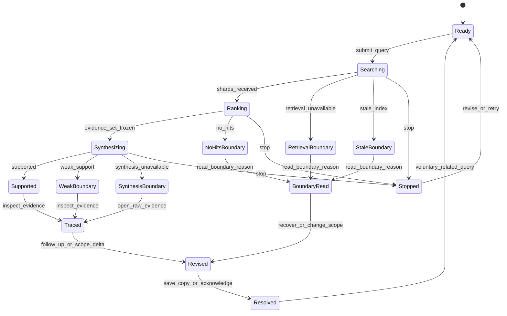

# Core Loop: Ask → Trace → Revise → Resolve

## Numeric model

```yaml
core_loop:
  name: ask-trace-revise-resolve
  target_period_seconds: 90
  accepted_period_seconds: [30, 180]
  target_ttk_seconds: 90
  ttk_tolerance: 0.15
  minimum_user_actions: 4
  harness_minimum_actions: 3
  action_count_rule: "resolve is both the fourth user action and the one reward event; it is not a fifth event"
  required_actions:
    - submit_query
    - inspect_evidence_or_boundary_reason
    - refine_scope_or_follow_up
    - resolve_finding_or_boundary
  minimum_reward_events: 1
  counted_rewards:
    - supported_result_saved
    - evidence_link_copied
    - insufficiency_acknowledged
  voluntary_repeat_rate_target: 0.70
  repeat_window_seconds: 180
  claim_evidence_coverage_required: 1.0
  unsupported_claims_allowed: 0
  implementation_status: not_implemented
  measurement_status: not_measured
```

## Loop timing and state graph

| Beat | Elapsed target | Player action | System response | Completion signal | Worldview |
|---|---:|---|---|---|---|
| 1. Ask | 0–15 s | Focus `/`, confirm Scope, submit Query | Freeze Query/Scope; create Dispatch and correlation IDs | `submit_query` | W-02, W-04, W-09 |
| 2. Trace | 15–55 s | Open ≥1 linked Log Shard, or read the Boundary Note reason when no Shard exists | Highlight Trace Line/provenance, or expose the exact owner and limit | `evidence_opened` or `boundary_reason_viewed` | W-06–W-12 |
| 3. Revise | 45–85 s | Ask a related follow-up or change entity/time/source Scope | Create child Dispatch; show parent and exact Scope delta | `follow_up_submitted` or `scope_revision_submitted` | W-04, W-09, W-13 |
| 4. Resolve | 60–100 s target, hard stop 180 s | Save/copy a supported Finding or acknowledge a correct Boundary Note | Emit exactly one counted reward and keep the Revision trail open | one valid reward event | W-05, W-11, W-12, W-14 |

Beats may overlap once Shards stream in, but event order remains `submit_query < (evidence_opened | boundary_reason_viewed) < revision < reward`. The resolve interaction is both the fourth player action and the one reward event, so the design's 4 actions equal the harness's 3 required actions plus reward—not 5 events. The service's supported terminal target of ≤15 s p95 is only one segment of the 90-second human loop.

## Core state machine



`Stopped` is a run-status transition, not a seventh terminal result. It preserves Query, Scope, retrieved Shards, and correlation ID, emits no Finding/reward, and awaits a Revision or retry.

## Deterministic first loop

The canonical smoke route uses Q01 and a related causality check:

| Sequence | Input/output | Required fact/state | Max elapsed target |
|---:|---|---|---:|
| 1 | Submit Q01: “What changed about Scout dash cooldown in P42, and why?” | Dispatch A; Scope P42 | 15 s |
| 2 | Open Claim “Cooldown changed from 8 s to 10 s” | Trace to E001 rank 1; E003 available top 5 | 55 s |
| 3 | Submit child Q02: “What caused Scout's 51.2% win rate?” with E002-only Scope | Dispatch B shows parent A and source delta | 85 s |
| 4 | Read `weak_support` Boundary Note and acknowledge | Observation is not causation; no E001 leakage; one reward | 100 s |

This route has 4 user actions including its reward-producing resolve, 1 legitimate reward, 2 Dispatches, 1 visible parent link, and 1 visible source-set delta. Its 100-second target fits both the 30–180 s hard loop and the common 76.5–103.5 s TTK band.

## Six archetype routes

| Archetype | Opening | Inspection | Revision | Reward | Target period |
|---|---|---|---|---|---:|
| Rapid incident operator | Q03 exact incident ID | E005 then E006 | “Was the database hypothesis retracted?” | Copy evidence link | 75 s |
| Evidence auditor | Q03 | E004–E006 in chronology | Narrow to correction log | Save Evidence Card | 105 s |
| Broad-corpus researcher | Q07 broad/newest | Inspect Freshness Stamp | Exclude E008 and narrow time | Acknowledge stale boundary | 120 s |
| Scope micro-optimizer | Q09 Alpha/Beta | Inspect Alpha label | Add/resolve Beta Scope | Acknowledge weak support | 90 s |
| Casual/low-APM creator | Q04 | Read empty Archive reason | Broaden time/entity Scope | Acknowledge no-hits | 60 s |
| Boundary adversary | Q08/Q10 | Open E009 as untrusted data | Stop then revise without fallback | Acknowledge weak/outage boundary | 90 s |

A later Stage 2 rotation uses all six; at least five are required. At least three must independently satisfy the fixture win condition using distinct strategies, and no archetype may own more than 50% of optimal fixture choices.

## Branch rules for all six outcomes

| Outcome | Required next action counted as Revision | Valid resolution | What cannot count |
|---|---|---|---|
| `supported` | Ask a related question or change Scope after inspection | Save/copy supported Finding | Saving without opening a Shard |
| `no_hits` | Broaden entity/time/source Scope | Acknowledge Boundary Note | A model-generated answer |
| `weak_support` | Refine Query or Scope | Acknowledge Boundary Note after inspecting Shards | Treating relevance as causation |
| `retrieval_unavailable` | Retry bounded retrieval or edit Query | Acknowledge owner-specific Boundary Note | Genkit/cache fallback |
| `synthesis_unavailable` | Open raw Shards, then retry synthesis or revise | Copy inspected Shard link or acknowledge | Hiding Shards |
| `stale_index` | Refresh if authorized or continue with explicit coverage bound | Acknowledge Freshness Stamp | Claiming current completeness |

## Context-preserving follow-up contract

Every Revision payload and display contains:

```yaml
revision_lineage:
  query_id: required
  parent_query_id: required
  correlation_id: required
  original_query_text: required
  child_query_text: required
  inherited_scope: required
  scope_delta:
    entity_added: []
    entity_removed: []
    time_from_changed: false
    time_to_changed: false
    sources_added: []
    sources_removed: []
  prior_index_snapshot_id: required
  child_index_snapshot_id: required
  prior_evidence_set_hash: required
  child_evidence_set_hash: required
  visible_field_coverage_required: 1.0
```

An unchanged Scope inherits the prior source/time/entity values and says “No scope changes.” A changed evidence-set hash with no visible delta or snapshot change is a defect, not an invisible optimization.

## Reward and anti-farming rules

- Count at most 1 reward event per Dispatch.
- `supported_result_saved` and `evidence_link_copied` require ≥1 `evidence_opened` event in that Dispatch.
- `insufficiency_acknowledged` requires the exact Boundary Note reason and recovery to be visible before acknowledgement.
- Reopening, animation, service speed, repeated copying, switching filters without submitting, or paid capacity earns 0 rewards.
- The voluntary repeat numerator includes one unprompted related second Query within 180 s after an eligible completed first loop. Scripted fixture repeats prove instrumentation only and contribute 0 human-repeat observations.

## Loading, stop, and offline behavior

- Acknowledgement of submit/input appears ≤100 ms p95.
- “Searching indexed logs…” appears ≤1 s p95.
- First Log Shard appears ≤5 s p95 when retrieval succeeds.
- Supported terminal arrives ≤15 s p95 under the frozen profile.
- Stop acknowledgement appears ≤1 s p95, aborts the active owner, and preserves already retrieved Shards.
- The current design observation is `inactive_not_verified` because no listener was found at the default local endpoint. The default UI state is “Checking local evidence service…”; it becomes “Ready” only after both required owners report healthy, otherwise shows the owner-specific Boundary Note.

## Measurement packet for later QA

For every eligible session, capture `submit_query_at`, first status/evidence times, `evidence_opened`, Revision event, reward event, parent/child IDs, Scope delta, outcome, elapsed loop time, and whether the second related Query was voluntary. Future evidence belongs under `qa/evidence/stage-1/<build>/g7/` for instrumentation and `qa/evidence/stage-2/<build>/g7/` for human repeat rate.

This is a modeled candidate, not an implemented or measured loop. No gate verdict is issued.

## Stage 2 Retune — 2026-08-11

### Loop decision

```yaml
stage_2_loop_retune:
  frozen_period_seconds: [30, 180]
  frozen_target_seconds: 90
  frozen_minimum_user_actions: 4
  frozen_minimum_reward_events: 1
  frozen_reward_events_per_dispatch_max: 1
  frozen_voluntary_repeat_rate_min: 0.70
  frozen_supported_terminal_p95_ms_max: 15000
  frozen_cancel_ack_p95_ms_max: 1000
  cancelled_finding_count: 0
  cancelled_reward_count: 0
  retuned_targets: []
  data_only_change_requested: none
  human_loop_measurement_status: not_measured
  gate_verdict: not_issued
```

The QA broadcast does not justify changing the loop period, action count, reward count, repeat target, or latency targets. It shows two supported-path defects and missing human evidence. A slower or failed synthesis cannot make the task easier by definition, add a reward, increase confidence, or remove the required Trace and Revise actions.

### QA response mapped to the loop

| QA item | Loop response | Status / next proof |
|---|---|---|
| QA-DISC-001 | Q03 still resolves only as `supported` after the confirmed GPU texture-upload cause, texture-prewarm fix, and superseded database hypothesis are traceable. | Frozen; rerun required. |
| QA-DISC-002 | The ≤15 s p95 supported-terminal segment stays inside the 90 s loop model; 18.464973 s is one observation and does not retune the segment or loop reward. | Target unchanged; p95 unmeasured. |
| QA-DISC-003 | `synthesis_unavailable` keeps raw Shards available and requires inspection before Revision/acknowledgement; it never substitutes for a supported Finding. | Frozen safe branch; selected-profile success unverified. |
| QA-DISC-004 | Selective reindexing supports the existing `stale_index` recovery path but does not establish a player cadence, repeat rate, or reward value. | Positive deterministic evidence; human recovery unmeasured. |
| QA-DISC-005 | E009 remains untrusted data, no fallback enters the loop, and unsupported claims allowed remain 0. | Frozen invariant; browser readability unmeasured. |
| QA-DISC-006 | Every child Revision still exposes parent ID and 100% of the field-level Scope delta; unchanged Scope says so explicitly. | Deterministic isolation contained; human lineage comprehension unmeasured. |
| QA-DISC-007 | Stop preserves retrieved Shards, creates 0 Findings and 0 rewards, and retains the ≤1 s p95 acknowledgement target. | Target unchanged; cancellation p95 and reward exclusion unmeasured. |
| QA-DISC-008 | Win rate, TTK, combo dominance, paid/free delta, parity, voluntary repeat, impression, and immersion remain targets, not outcomes. | No numeric retune; qualifying measurements absent. |
| QA-DISC-009 | The one 3,587.5 ms first-evidence observation does not alter ≤5 s p95; mobile still moves focus from Finding/Boundary to the in-flow evidence panel without changing action order. | Smoke observation only; multi-viewport and accessibility packet absent. |
| QA-DISC-010 | Six blinded archetype routes, task completion, reward validity, voluntary related re-entry within 180 s, and later soak/immersion remain to be observed. | Human and operational outcomes unmeasured. |
| QA-DEF-001 | The Q03 `weak_support` terminal cannot count as Resolve success for its supported fixture and cannot earn the supported save/copy route. | Open S2; only QA can close after frozen rerun. |
| QA-DEF-002 | Q01/Q03 `synthesis_unavailable` on 1.5b/0.5b is a safe boundary route, not supported-loop completion or profile qualification. | Open S2; profiles remain disqualified pending frozen rerun. |

### Blinded Stage 2 measurement packet

For each of the six archetypes, QA should present the assigned fixture without target values or expected-state coaching and record: eligible sessions \(n\); correct task completions; elapsed full-loop seconds; all four ordered actions; valid reward count; invalid/cancelled reward count; parent/child and Scope-delta visibility; terminal state; and unprompted related re-entry within 180 s. Report task-win and repeat numerators/denominators per archetype. Do not pool deterministic assertions with human sessions, and do not convert missing sessions into losses or zero-valued outcomes.
