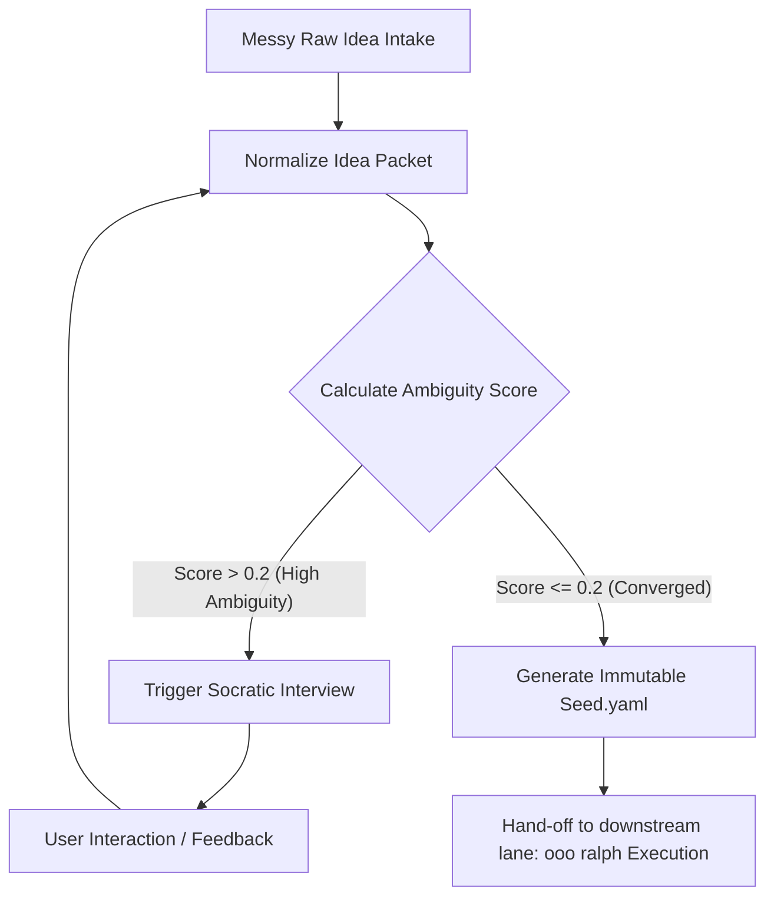

# Ambiguity-Driven Socratic Incubation (ADSI) Architecture

## 1. 아키텍처 배경 및 필요성
일반적인 기획 단계(`bmad-idea`)에서는 유저의 파편화된 아이디어(Messy raw idea)를 정리하지만, 아이디어가 비즈니스/개발 측면에서 얼마나 구체적이고 구현 가능한지(Feasible) 측정하기 어렵습니다. 
반면 `ooo` (Ouroboros)는 명확하게 정의된 명세(`seed.yaml`)를 바탕으로 검증 루프를 지속하지만, 초기 아이디어가 고도로 추상적일 때는 명세 작성 자체가 지체되는 단점이 있습니다.

**ADSI (Ambiguity-Driven Socratic Incubation) 아키텍처**는 두 스킬의 강점을 융합하여, **초기 기획 수립 시부터 모호성을 실시간 측정하고, 기준치 이하로 수렴할 때까지 Socratic 대화를 반복 수행**하는 기획 이터레이션 시스템을 제공합니다.

---

## 2. ADSI 핵심 프로세스 프레임워크



### [단계 1] 아이디어 패킷 표준화 (Normalization)
* `/bmad-idea`의 템플릿 양식에 맞춰 유저 입력을 표준 JSON/YAML 패킷으로 가공합니다.
* 분류 요소: Domain, Stage, Primary Audience, Core Goal, Constraints, Success Criteria.

### [단계 2] 실시간 모호성 지수(Ambiguity Score) 산정
`ooo` 명세 수렴 판단 기준인 **Ambiguity Gate** 공식을 적용합니다.
$$\text{Ambiguity Score} = 1.0 - \left( 0.4 \times C_{\text{Goal}} + 0.3 \times C_{\text{Constraints}} + 0.3 \times C_{\text{Success}} \right)$$
* $C_{\text{Goal}}$ (목표 명확성): 비즈니스 가치와 결과물이 명확하게 명시되었는가 (0.0 ~ 1.0)
* $C_{\text{Constraints}}$ (제약조건 정밀도): 환경, 스택, 외부 한계가 선언되었는가 (0.0 ~ 1.0)
* $C_{\text{Success}}$ (인수 조건 완성도): 성공을 증명할 수 있는 정량적 요건이 존재합니까 (0.0 ~ 1.0)

### [단계 3] 소크라테스식 인큐베이션 루프 (Socratic Incubation)
* 모호성 스코어가 **`0.2` 초과**일 경우, 시스템은 강제로 기획 완료를 차단하고 **Socratic Interviewer** 페르소나를 기동합니다.
* 일반적인 브레인스토밍이 아닌 **가장 점수가 낮은 차원(목표/제약/성공)**에 대해 정밀하게 질문을 던져 유저의 구체적 답변을 유도합니다.

### [단계 4] 불변 시드(Immutable Seed) 락업 및 Handoff
* 모호성이 **`0.2` 이하**로 진입하면, 기획이 완전히 수렴(Converged)된 것으로 판단하여 `seed.yaml`을 생성 및 락업합니다.
* 생성된 `seed.yaml`은 즉시 다운스트림 태스크(`/task-planning` 등)로 안전하게 라우팅되어 `ooo ralph` 루프에 연결됩니다.

---

## 3. ADSI Handoff 스키마 규격

기획 완료 후 `ooo`와 다운스트림 개발에 전달되는 완성형 아이디어 시드 사양입니다:

```yaml
# Generated by ADSI / bmad-idea
seed_version: "1.0.0"
metadata:
  incubated_at: "2026-05-22T00:35:00Z"
  ambiguity_score: 0.15
  chosen_framing: "concept-shaping"
spec:
  goal: "FunQA RAG의 Rerank 구조적 출력 기능 개선 및 API 정합성 검증"
  context:
    domain: "product"
    primary_audience: "Game Creator / Developer"
  constraints:
    - "Genkit version >= 0.5"
    - "No raw regex fallback parsing inside rerank logic"
  acceptance_criteria:
    - "ai.generate calls output.schema with verified Zod schema"
    - "Smoke tests return status code 200 with dynamic confidence reasoning"
```

---

## 4. 관련 참조 정보
* [[bmad-idea]] - 초기 아이디어 프레이밍 가이드
* [[ooo]] - Ouroboros 명세 기반 완성 루프 정보
